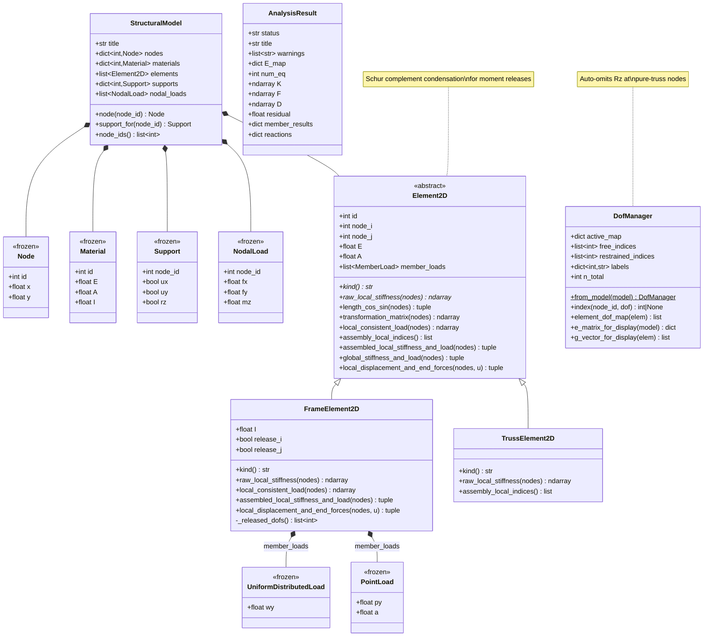

# CE 4011 Assignment 3 — 2D Structural Analysis Program

**Ali Utku Tekin — 2744076**  
MSc. Structural Engineering, 3rd Semester | Spring 2025-2026

## Overview

Extended 2D structural analysis program using the Direct Stiffness Method with NumPy.

## Features

| Feature | Implementation |
|---|---|
| Frame elements | `FrameElement2D` — 6-DOF beam-column (inheritance from `Element2D`) |
| Truss elements | `TrussElement2D` — axial-only, rotational DOFs auto-suppressed |
| Moment releases | Schur-complement static condensation (exact for k and p) |
| Member loads | UDL and point loads via Hermitian shape functions |
| Mechanism detection | SVD rank check with null-space DOF identification |
| Connectivity check | DFS graph traversal — detects floating components |

## Architecture

```
Element2D (abstract base)
├── FrameElement2D  — axial + flexural, optional releases
└── TrussElement2D  — axial only, suppresses Rz DOFs

DofManager — dynamic equation numbering, auto-omits Rz at pure-truss nodes
```

## Usage

```bash
python -m structural_analysis.main inputs/portal_frame.txt
python -m pytest tests/test_all.py -v   # 45 tests
```

## Test Suite (45 tests)

### Q3(c) Updated Test Case

Run:
python run_q3c_vertical_frame_case.py

This case demonstrates:
- disconnected but supported substructures
- block-diagonal stiffness behavior
- warning + successful solution

- **22 unit tests**: geometry, frame/truss stiffness, releases, FEF
- **9 interface tests**: DOF numbering, assembly, validation
- **14 regression tests**: portal frame (A2), cantilever, SS beam, truss, mechanism, hinge+load

## AI Reference

Claude (Anthropic) and ChatGPT (OpenAI).
